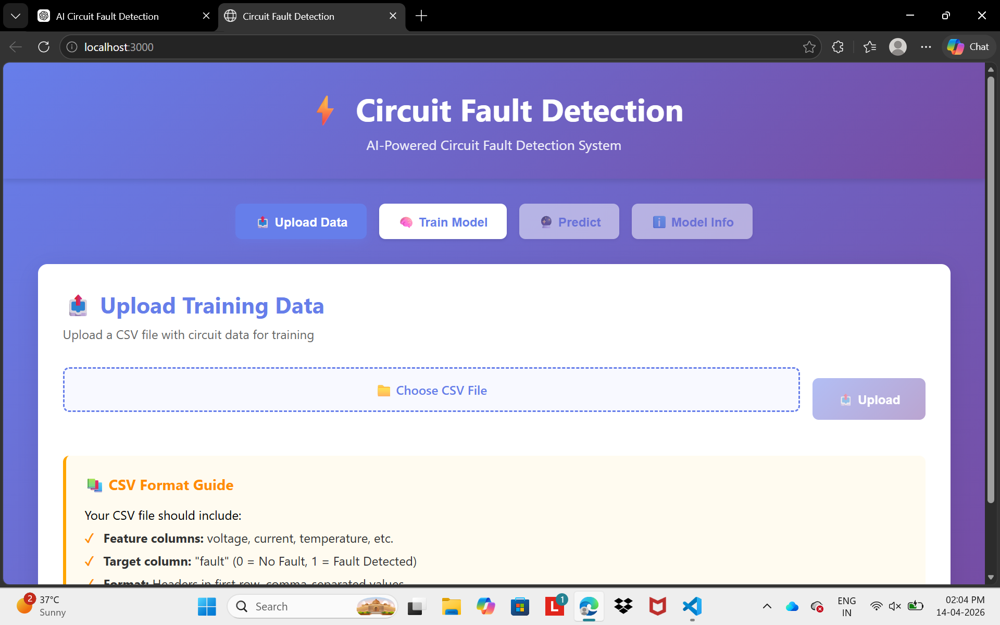
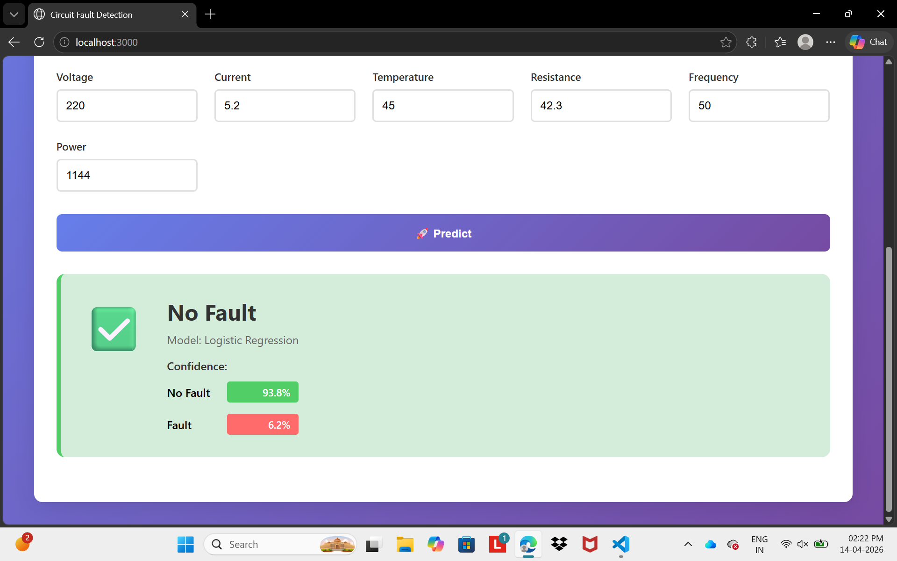
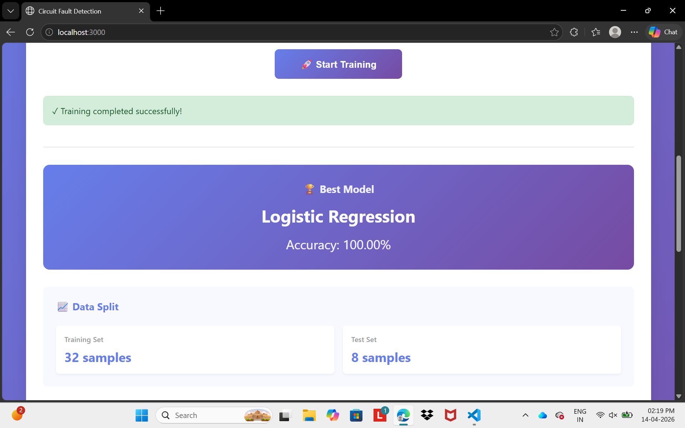
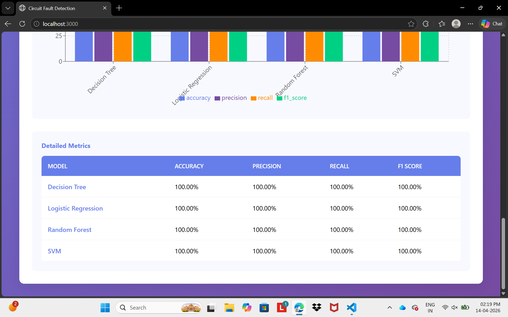
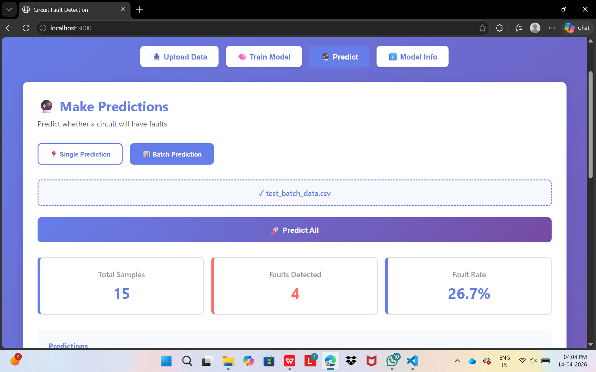
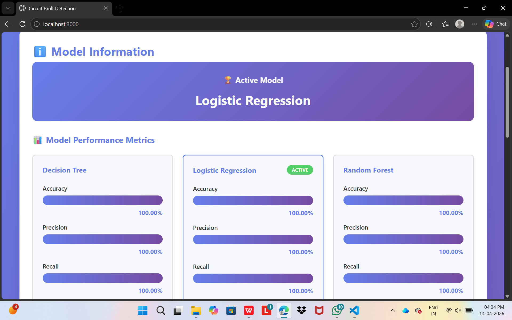

# Circuit Fault Detection System

AI-powered circuit fault detection using Machine Learning models. This web application trains multiple ML models on circuit data and can predict whether a circuit will have faults.

## 🎯 Features

- **📤 Data Upload**: Upload CSV files with circuit training data
- **🧠 Multiple ML Models**: Train and compare 4 different models:
  - Logistic Regression
  - Decision Tree
  - Random Forest
  - Support Vector Machine (SVM)
- **📊 Performance Metrics**: View accuracy, precision, recall, and F1 scores
- **🔮 Single Prediction**: Input circuit parameters and get fault predictions
- **📤 Batch Prediction**: Upload multiple samples for batch testing
- **📈 Visualizations**: Interactive charts showing model performance
- **💾 Model Persistence**: Save trained models for later use

## 🚀 Getting Started

### Prerequisites
- Python 3.8+
- Node.js 14+
- npm or yarn

### Backend Setup

1. Navigate to the backend directory:
   ```bash
   cd backend
   ```

2. Install Python dependencies:
   ```bash
   pip install -r requirements.txt
   ```

3. Run the Flask server:
   ```bash
   python app.py
   ```

The server will start at `http://localhost:5000`

### Frontend Setup

1. Navigate to the frontend directory:
   ```bash
   cd frontend
   ```

2. Install npm dependencies:
   ```bash
   npm install
   ```

3. Start the React development server:
   ```bash
   npm start
   ```

The application will open at `http://localhost:3000`

## 📋 Data Format

Your CSV file should include:

**Columns (Features):**
- voltage (AC/DC voltage level)
- current (Current draw)
- temperature (Component temperature)
- resistance (Circuit resistance)
- frequency (Operating frequency)
- power (Power consumption)
- fault (Target column: 0 = No Fault, 1 = Fault Detected)

**Example:**
```
voltage,current,temperature,resistance,frequency,power,fault
220,5.2,45,42.3,50,1144,0
230,5.1,46,45.1,50,1173,0
...
```

Sample data is provided in `sample_data/circuit_training_data.csv`

## 🔄 Workflow

1. **Upload Data**: Start by uploading your CSV training data
2. **Train Models**: Select which models to train and start training
3. **View Metrics**: Compare model performance across different metrics
4. **Make Predictions**: Use the trained model to predict on new circuit data
5. **Analyze Results**: View model information and performance details

## 📊 Model Performance

The system automatically:
- Splits data into 80% training and 20% testing
- Scales features using StandardScaler
- Trains all selected models
- Evaluates using multiple metrics
- Selects the best performing model

## 🔧 API Endpoints

### Backend API Reference

- `POST /api/upload-data` - Upload and preview training data
- `POST /api/train` - Train models on uploaded data
- `POST /api/predict` - Make single prediction
- `POST /api/batch-predict` - Make batch predictions
- `GET /api/model-info` - Get current model information
- `GET /api/health` - Health check

## 📁 Project Structure

```
circuit-fault-detection/
├── backend/
│   ├── app.py              # Flask application
│   ├── requirements.txt    # Python dependencies
│   └── saved_models/       # Trained model storage
├── frontend/
│   ├── public/
│   │   └── index.html
│   ├── src/
│   │   ├── components/
│   │   │   ├── DataUpload.js
│   │   │   ├── ModelTraining.js
│   │   │   ├── Prediction.js
│   │   │   ├── ModelInfo.js
│   │   │   └── MetricsChart.js
│   │   ├── App.js
│   │   └── index.js
│   └── package.json
├── sample_data/
│   └── circuit_training_data.csv
└── README.md
```

## 🧠 Machine Learning Models

### 1. Logistic Regression
- Simple linear classifier
- Fast training and prediction
- Good for baseline performance

### 2. Decision Tree
- Tree-based model with interpretable rules
- Can capture non-linear patterns
- Prone to overfitting on complex data

### 3. Random Forest
- Ensemble of decision trees
- Robust to overfitting
- Generally high accuracy

### 4. Support Vector Machine (SVM)
- Powerful classifier for complex patterns
- Slower training but often excellent accuracy
- Good for high-dimensional data

## 📈 Metrics Explained

- **Accuracy**: Percentage of correct predictions
- **Precision**: Of predicted faults, how many were actually faults
- **Recall**: Of actual faults, how many were detected
- **F1 Score**: Harmonic mean of Precision and Recall

## 🐛 Troubleshooting

### Connection Error
If you get a connection error, ensure:
- Backend is running on port 5000
- Frontend is accessing `http://localhost:5000`
- CORS is enabled (already configured)

### Memory Error
If you encounter memory issues with large datasets:
- Reduce the dataset size
- Use cloud resources
- Optimize the model architecture

## Output Screenshots








## 🔐 Security Notes

For production deployment:
- Add authentication
- Implement rate limiting
- Validate all inputs
- Use environment variables for sensitive data
- Deploy with HTTPS

## 📝 License

This project is open source and available under the MIT License.

## 👨‍💻 Contributing

Contributions are welcome! Please feel free to submit issues and pull requests.

## 📞 Support

For issues or questions, please open an issue in the repository.

---

**Happy Fault Detection! ⚡**
